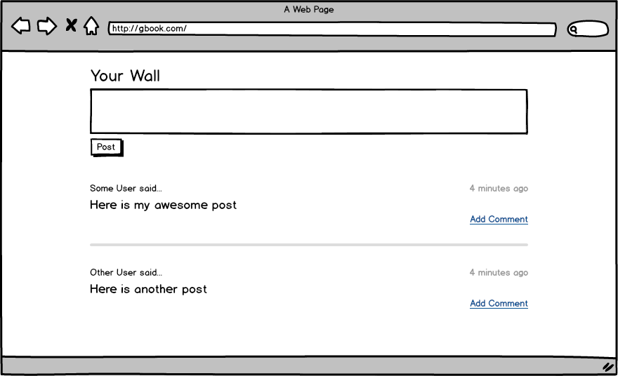
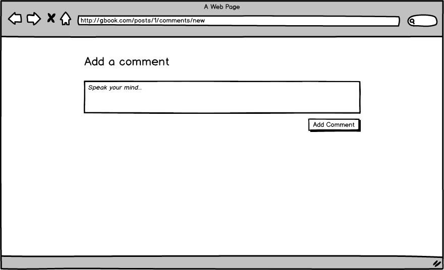
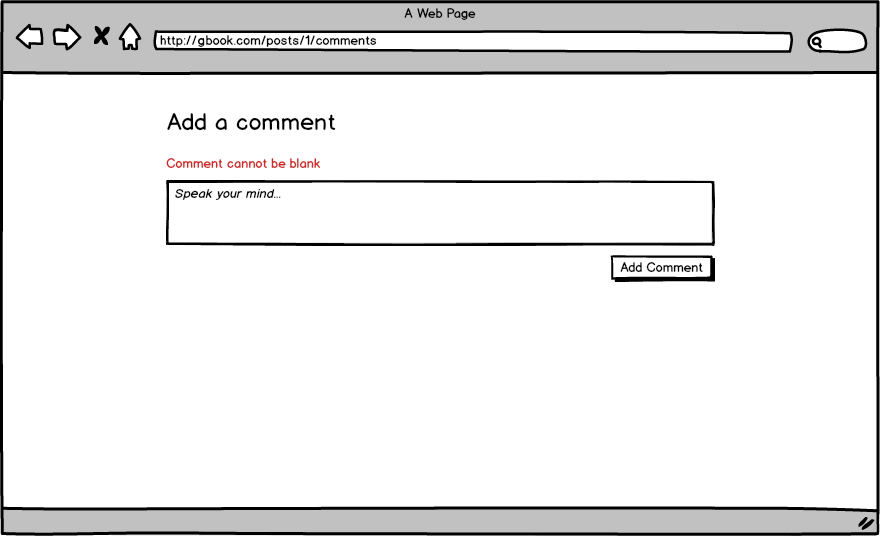
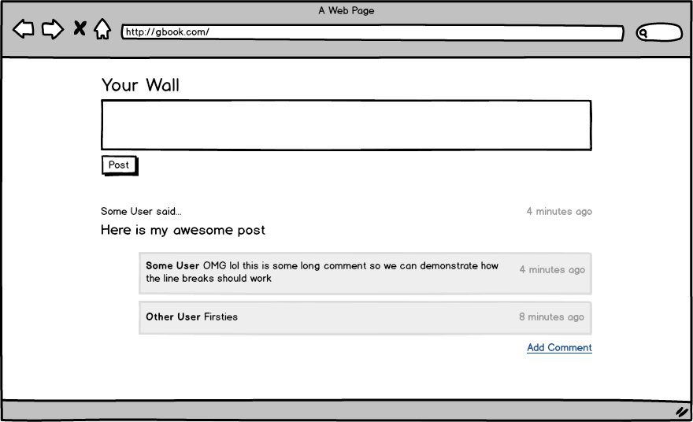

# g2 Midterm Assessment

## Setup

* `bundle`
* `rake db:create db:migrate db:seed`
* `rails s`

You can run specs with:

* `rspec`

Note: email/password combinations for existing users populated by `rake db:seed`
can be found in the db/seeds.rb file.

## Story

**Users can add comments to a post**
    
    Given there is an existing post
    And I am a logged in user
    When I go to the homepage (the wall)
    Then I should see an "Add Comment" link
    When I click "Add Comment" I should see the new comment form
    And I fill in a comment
    And I press "Add Comment"
    Then I should be redirected back to the homepage (the wall)
    And I should see the comment beneath the post

NOTES:

1. The path for the new comment form must match the path in the wireframes
1. On the comment form, the button should align with the right edge of the comment box, like the wireframes
1. On the wall page, all comments should be indented, and each should be in a box with a light-gray background, and a border that is a slightly darker gray, as shown in the wireframes
1. Times should be relative, as show in the wireframes

**Users must enter a comment body**

    When I click "Add Comment" on a post
    And I press the "Add Comment" button without filling anything in
    Then I should see a messages that reads "Comment cannot be blank"

NOTES: 

1. The error message must read "Comment cannot be blank" exactly, like the wireframes
1. The error message should be maroon

## Wireframes

**Empty Wall**

**New Comment Form**

**New Comment Form w/ Errors**

**Wall post with comments**

